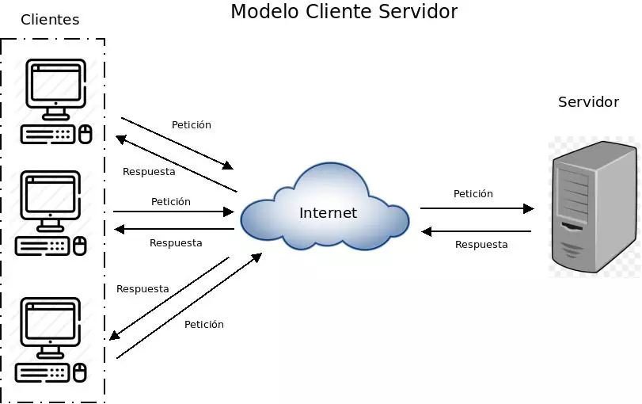

# Guía de Estudio: Modelo Cliente-Servidor para AWS Software Architect

## 1. **¿Qué es el modelo cliente-servidor?**

### Definición:
El **modelo cliente-servidor** es una arquitectura de red en la que los clientes hacen solicitudes a un servidor que procesa esas solicitudes y devuelve respuestas. 

Los **clientes** son las aplicaciones o dispositivos que envían solicitudes, y los **servidores** son los sistemas que responden a esas solicitudes.

### Analogía:
Imagina que:

1. un **cliente** (**dispositivo**) es como una persona en un restaurante que pide comida al camarero (la **red**). 

2. El camarero recibe el pedido, lo lleva a la cocina (**servidor**) para ser preparado y luego lo trae de vuelta al cliente. 

El cliente no sabe cómo preparar la comida, solo la solicita y espera una respuesta.

## 2. **Componentes principales del modelo cliente-servidor**

- **Cliente:** Es el dispositivo o aplicación que solicita servicios. Puede ser un navegador web, una aplicación móvil, o cualquier software que se conecte a un servidor.
  
- **Servidor:** Es el sistema que recibe, procesa y responde a las solicitudes del cliente. El servidor podría estar alojado en la nube, como en AWS.

- **Red de Comunicación:** Los clientes y servidores se comunican a través de una red, como Internet. La red se asegura de que la solicitud del cliente llegue al servidor y la respuesta regrese al cliente.

### Analogía:
El **cliente** sería el cliente del restaurante, 
el **servidor** es el chef de la cocina que prepara la comida, y la **red** sería el camarero que lleva los mensajes entre ambos.

## 3. **Tipos de servidores en el modelo cliente-servidor**

- **Servidor de archivos:** Guarda y maneja archivos solicitados por los clientes.
- **Servidor de bases de datos:** Responde a consultas de bases de datos de los clientes.
- **Servidor web:** Sirve páginas web solicitadas por los navegadores de los clientes.
- **Servidor de aplicaciones:** Proporciona servicios y procesos más complejos a las aplicaciones cliente.

### Analogía:
Si el cliente es un comensal en un restaurante:
- Un **servidor de archivos** sería el menú con todas las opciones.
- Un **servidor de bases de datos** sería la cocina que tiene ingredientes y recetas listadas.
- Un **servidor web** sería el camarero que lleva la comida (página web) al cliente.
- Un **servidor de aplicaciones** sería el chef que prepara platos complejos (funcionalidades de aplicaciones).

## 4. **Comunicación entre Cliente y Servidor**

### Protocolos comunes:
- ### **HTTP/HTTPS:** 
> Hypertext Transfer Protocol / Hypertext Transfer Protocol Secure 

son protocolos que permiten la comunicación entre un navegador (cliente) y un servidor web.

Utilizados en la web para transferir información (como texto, imágenes, videos, etc.) entre el cliente (navegador) y el servidor.

| Característica         | HTTP                          | HTTPS                          |
|------------------------|-------------------------------|--------------------------------|
| **Cifrado**            | No                           | Sí                            |
| **Seguridad**          | Baja                         | Alta                          |
| **Certificado digital**| No requerido                 | Requiere un certificado SSL/TLS|
| **Velocidad**          | Más rápido (sin cifrado)     | Ligeramente más lento (por el cifrado) |

    **Cómo funciona HTTPS (proceso simplificado)**
1. Conexión inicial:
El cliente (navegador) se conecta al servidor y solicita una conexión segura.
2. Intercambio de certificados:
El servidor envía su certificado digital al cliente para demostrar su identidad.
3. Clave de cifrado:
Se establece una clave de sesión para cifrar los datos enviados y recibidos.
4. Transmisión segura:
Toda la comunicación entre el cliente y el servidor está cifrada.

 - ## **TCP/IP:** 
> Transmission Control Protocol / Internet Protocol

Un conjunto de protocolos para la comunicación en redes.

    Modelo TCP/IP

Es un modelo que involucra hardware y software y describe un conjunto de reglas para que cada computadora de una red pueda comunicarse. 

Permite que cada dispositivo (host) tenga una dirección única para enviar y recibir datos.

    **Componentes principales**
- TCP (Transmission Control Protocol):

Divide los datos en paquetes más pequeños.
Asegura que los paquetes se entreguen correctamente y en orden.
Reenvía paquetes perdidos o corruptos.
- IP (Internet Protocol):

Encargado de las direcciones y el enrutamiento.
Asegura que los paquetes lleguen a su destino, pero no garantiza la confiabilidad.

    **Este modelo cuenta con 4 capas que son:**

- **Capa de acceso al medio:**  
  Define cómo los datos se transmiten físicamente a través del hardware.  
  *(Ejemplo: Ethernet, Wi-Fi).*

- **Capa de internet:**  
  Determina la ruta para los datos mediante protocolos como **IP**.  
  *(Ejemplo: Enviar un paquete desde tu computadora hasta un servidor remoto).*

- **Capa de transporte:**  
  Asegura la transmisión confiable de datos o la rapidez dependiendo del protocolo:  
  - **TCP:** Transmisión confiable y en orden.  
  - **UDP:** Transmisión rápida, pero sin confiabilidad.  
  *(Ejemplo: TCP para correos y descargas, UDP para videollamadas).*

- **Capa de aplicación:**  
  Es la interfaz entre el usuario y la red. Aquí se usan protocolos como:  
  - **HTTP/HTTPS** (páginas web).  
  - **SMTP** (correo electrónico).  
  - **FTP** (transferencia de archivos).  

La correcta ejecución de cada capa garantiza la comunicación entre varios hosts de manera segura.

    **Proceso de Comunicación en TCP/IP**

1. División de datos:
La información que se envía (como un archivo o una página web) se divide en paquetes más pequeños.
2. Añadido de información:
Cada paquete recibe información adicional, como direcciones IP de origen y destino.
3. Envío:
Los paquetes viajan de un dispositivo a otro a través de la red.
4. Recepción:
El dispositivo receptor reorganiza los paquetes para reconstruir los datos originales.

- ## **WebSockets:** 

WebSockets es un protocolo de comunicación que permite establecer una conexión bidireccional y persistente entre un cliente (como un navegador) y un servidor. 

**Esto es especialmente útil para aplicaciones en tiempo real**, como chats, juegos, notificaciones, transmisiones en vivo, entre otros.

### **Características principales de WebSocket:**
- **Conexión persistente:**  
  A diferencia de HTTP, que establece una conexión para cada solicitud/respuesta, WebSocket mantiene la conexión abierta, permitiendo una comunicación continua.
  
- **Bidireccional:**  
  El servidor y el cliente pueden enviar y recibir datos en cualquier momento, lo que permite la interacción en tiempo real.
  
- **Baja latencia:**  
  Debido a la conexión persistente, los datos se envían sin la sobrecarga de los encabezados HTTP, lo que mejora la velocidad de comunicación.

- **Uso de un solo puerto:**  
  WebSocket utiliza el puerto **80** para conexiones no cifradas (ws://) y el puerto **443** para conexiones cifradas (wss://).

### **¿Cómo funciona WebSocket?**
1. **Establecimiento de la conexión:**  
   El cliente envía una solicitud HTTP especial llamada *"handshake"* al servidor. Si el servidor soporta WebSocket, responde con una confirmación para establecer la conexión WebSocket.
   
2. **Comunicación en tiempo real:**  
   Una vez establecida la conexión, tanto el cliente como el servidor pueden enviar mensajes en cualquier momento sin tener que esperar una solicitud específica.
   
3. **Cierre de la conexión:**  
   Cuando se termina la comunicación, cualquiera de los dos lados puede cerrar la conexión WebSocket.

### **Analogía**:
- La comunicación entre el cliente y el servidor es como la conversación entre el comensal y el camarero. 
- El camarero (red-servidor) entiende el idioma del comensal (cliente), pero ambos siguen un conjunto de reglas de conversación (protocolos) para asegurarse de que el pedido se entienda correctamente.

## 5. **Arquitecturas del Cliente-Servidor**

Existen varias arquitecturas dentro del modelo cliente-servidor:

- **Cliente-Servidor 2-Tier:** El cliente se comunica directamente con el servidor.
  
- **Cliente-Servidor 3-Tier:** Aquí, el cliente se comunica con un servidor de aplicaciones, que a su vez se comunica con un servidor de bases de datos.

- **Cliente-Servidor N-Tier:** Una arquitectura más compleja con múltiples capas, como en microservicios.

### Analogía:
- **2-Tier:** El camarero (cliente) se comunica directamente con el chef (servidor).
- **3-Tier:** El camarero (cliente) habla con el maître (servidor de aplicaciones), quien luego se comunica con el chef (servidor de bases de datos).
- **N-Tier:** El cliente habla con varios responsables en diferentes áreas (camarero, maître, chef, etc.).

## 6. **AWS y el modelo Cliente-Servidor**

En el contexto de AWS, el modelo cliente-servidor se implementa mediante varios servicios:

- **Amazon EC2 (Elastic Compute Cloud):** Es un servidor virtual donde puedes alojar tu aplicación, gestionando las solicitudes de los clientes.
  
- **Amazon RDS (Relational Database Service):** Es un servidor de bases de datos gestionado que responde a las consultas de bases de datos.
  
- **Amazon S3 (Simple Storage Service):** Puede almacenar archivos estáticos que los servidores web pueden enviar a los clientes.
  
- **AWS Lambda:** Permite ejecutar funciones sin necesidad de gestionar servidores, ideal para arquitecturas de microservicios.

### Analogía:
En AWS, los **servidores virtuales (EC2)** serían como los chefs en una cocina, gestionando las solicitudes. **RDS** sería como una base de datos de recetas (bases de datos) que los chefs consultan. **S3** sería como una bodega donde se almacenan los ingredientes (archivos) que se sirven a los clientes.

## 7. **Ventajas del modelo Cliente-Servidor**

- **Escalabilidad:** Puedes agregar más servidores a medida que aumentan las solicitudes de los clientes.
  
- **Seguridad:** Los servidores pueden estar protegidos detrás de firewalls y sistemas de autenticación.

- **Mantenimiento centralizado:** El mantenimiento y las actualizaciones se realizan en el servidor sin afectar a los clientes.

### Analogía:
En un restaurante, si llegan más comensales (más clientes), puedes contratar más camareros (servidores) sin que los comensales se vean afectados directamente. Los cambios en el menú (actualizaciones de servidor) solo se aplican en la cocina, no en las mesas de los comensales.

## 8. **Desventajas del modelo Cliente-Servidor**

- **Dependencia del servidor:** Si el servidor se cae, los clientes no pueden acceder a los servicios.
  
- **Costos de infraestructura:** Mantener y administrar servidores puede ser costoso y complejo.

### Analogía:
Si el chef (servidor) no está disponible, el restaurante (sistema) no puede servir comida (servicios) a los comensales (clientes), lo que interrumpe el servicio.

## 9. **Mejoras y avances con el modelo Cliente-Servidor**

- **Balanceo de carga:** Distribuye las solicitudes entre varios servidores para mejorar el rendimiento.
  
- **Arquitectura sin servidor:** Usa servicios como AWS Lambda para eliminar la necesidad de servidores tradicionales y reducir costos.

- **Microservicios:** Dividir una aplicación en servicios pequeños y autónomos que interactúan entre sí.

### Analogía:
- Si el restaurante tiene varios chefs (servidores) trabajando en diferentes áreas, el servicio será más rápido y eficiente. 
- El **balanceo de carga** sería como asignar diferentes chefs a diferentes platos. 
- Los **microservicios** serían como tener chefs especializados en un tipo de plato (ensaladas, postres, carnes, etc.). algo como un buffet

## 10. **Resumen:**

El modelo cliente-servidor es una arquitectura fundamental en el desarrollo de aplicaciones y sistemas. 

En AWS, esta arquitectura se implementa mediante servicios como EC2, RDS, S3, y Lambda. Comprender cómo funciona este modelo y sus aplicaciones en la nube te ayudará a diseñar soluciones escalables y eficientes.

---

### Conceptos clave:
- Cliente: Solicita servicios.
- Servidor: Responde a las solicitudes.
- Red: Conexión entre cliente y servidor.
- AWS: Servicios en la nube que implementan el modelo cliente-servidor.

el modelo cliente-servidor es una forma de organizar la comunicación y gestión de recursos entre diferentes componentes de un sistema.

